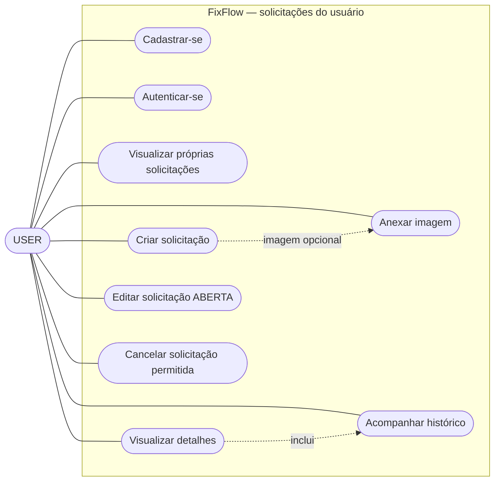
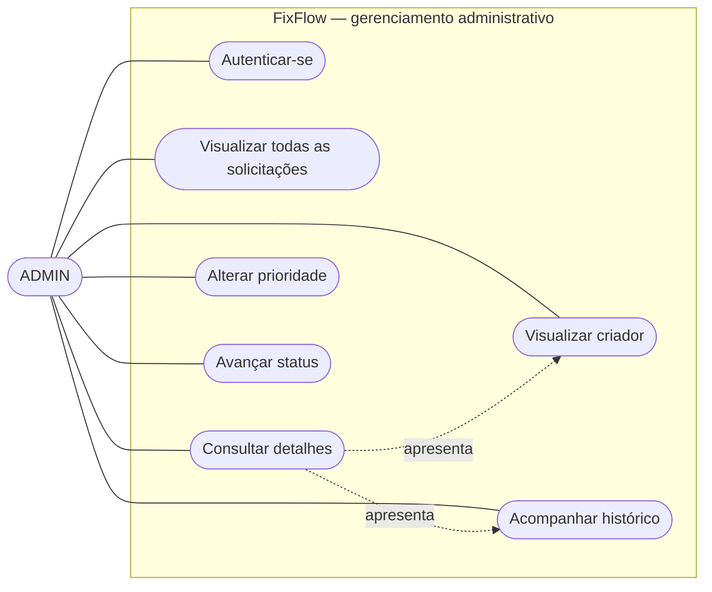

# Diagramas de Casos de Uso

Os diagramas representam os recursos disponíveis no MVP do FixFlow para os perfis `USER` e `ADMIN`.

## Diagrama 1 — Solicitações pelo USER

O usuário comum cadastra e autentica sua conta, cria e acompanha somente as próprias solicitações. A edição e o envio de imagens são permitidos em `ABERTA`; o cancelamento é permitido em `ABERTA` ou `EM_ANALISE`.

## Diagrama 2 — Gerenciamento pelo ADMIN

O administrador consulta todas as solicitações e seus criadores, visualiza imagens e histórico, ajusta a prioridade de pedidos não finalizados e executa apenas a próxima transição operacional permitida.

## Requisitos relacionados

- **Diagrama 1:** RF001, RF002, RF004, RF005, RF006, RF007, RF008, RF009, RF013, RF014 e RF015.
- **Diagrama 2:** RF002, RF007, RF010, RF011, RF012, RF013 e RF014.
