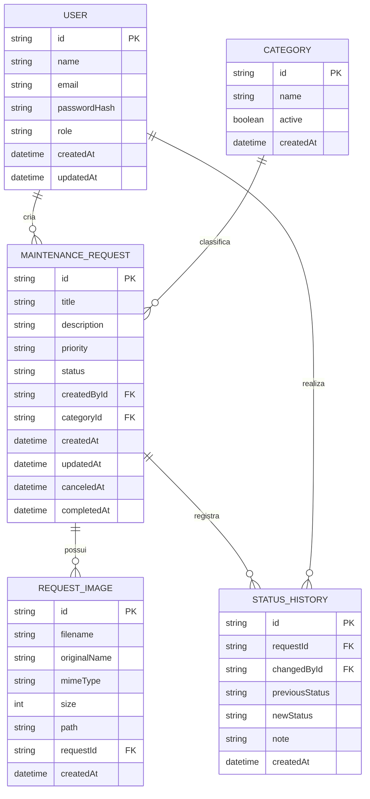

# Diagrama Entidade Relacionamento

## Objetivo

Representar o modelo implementado do MVP FixFlow. O diagrama deriva de `docs/modelagem-dados.md` e corresponde ao schema Prisma e às migrations SQLite atuais.

## Entidades

- **USER:** conta, credencial protegida e perfil `USER` ou `ADMIN`.
- **CATEGORY:** classificação padronizada das solicitações.
- **MAINTENANCE_REQUEST:** pedido, autoria, prioridade e estado atual.
- **REQUEST_IMAGE:** metadados de imagem vinculada ao pedido.
- **STATUS_HISTORY:** registro de cada transição de status e seu responsável.

## Diagrama

As opções de nulidade e os valores de `role`, `priority` e `status` estão detalhados em `docs/modelagem-dados.md`. Em `STATUS_HISTORY`, `previousStatus` é nulo somente no evento inicial de criação.

## Cardinalidades

- **User × MaintenanceRequest:** um usuário pode criar zero ou muitas solicitações; cada solicitação tem exatamente um criador.
- **Category × MaintenanceRequest:** uma categoria pode classificar zero ou muitas solicitações; cada solicitação tem exatamente uma categoria.
- **MaintenanceRequest × RequestImage:** uma solicitação pode ter zero ou muitas imagens; cada imagem pertence a uma solicitação.
- **MaintenanceRequest × StatusHistory:** uma solicitação pode ter zero ou muitos eventos de status; cada evento pertence a uma solicitação.
- **User × StatusHistory:** um usuário pode realizar zero ou muitas mudanças registradas; cada evento aponta para um usuário responsável.
