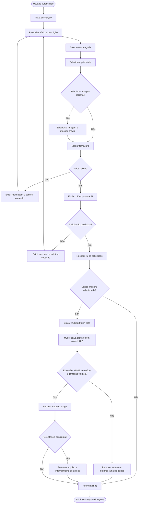

# Diagramas de Atividade

## Diagrama 1 — Abertura de solicitação



O cadastro principal continua em JSON. A imagem opcional é enviada depois que a API devolve o ID. Se esse segundo envio falhar, a solicitação permanece criada e o usuário pode tentar novamente enquanto ela estiver `ABERTA`.

## Diagrama 2 — Fluxo de atendimento

```mermaid
flowchart LR
    A([ABERTA])
    B([EM_ANALISE])
    C([EM_ANDAMENTO])
    D([[CONCLUIDA<br/>estado final]])
    E([[CANCELADA<br/>estado final]])

    A -- ADMIN avança status --> B
    B -- ADMIN avança status --> C
    C -- ADMIN avança status --> D
    A -- USER cancela pedido próprio --> E
    B -- USER cancela pedido próprio --> E
```

O administrador segue a ordem `ABERTA → EM_ANALISE → EM_ANDAMENTO → CONCLUIDA`. O usuário proprietário pode cancelar somente em `ABERTA` ou `EM_ANALISE`. `CONCLUIDA` e `CANCELADA` não possuem transições de saída.

## Requisitos relacionados

- **Diagrama 1:** RF004, RF005, RF007, RF013, RF015, RNF007, RNF009, RNF010 e RNF011.
- **Diagrama 2:** RF007, RF009, RF011, RF013 e RF014.
