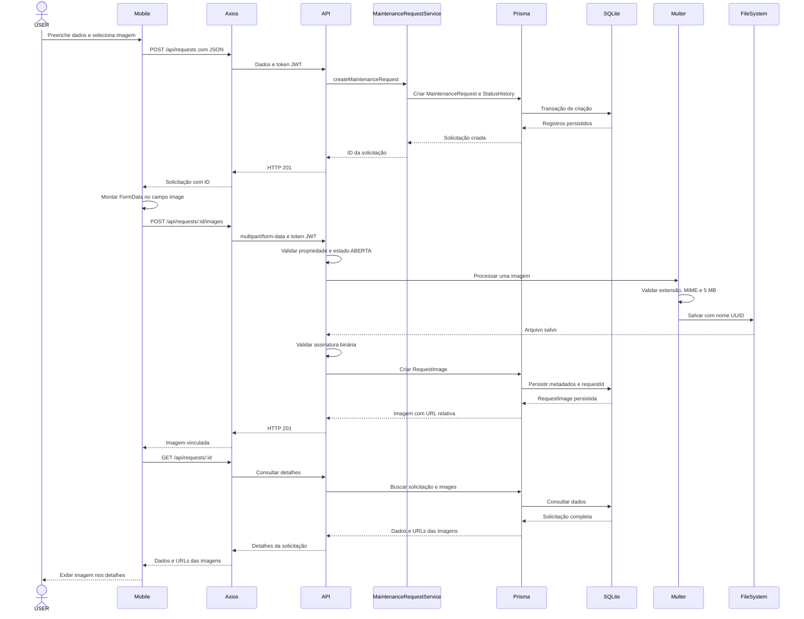
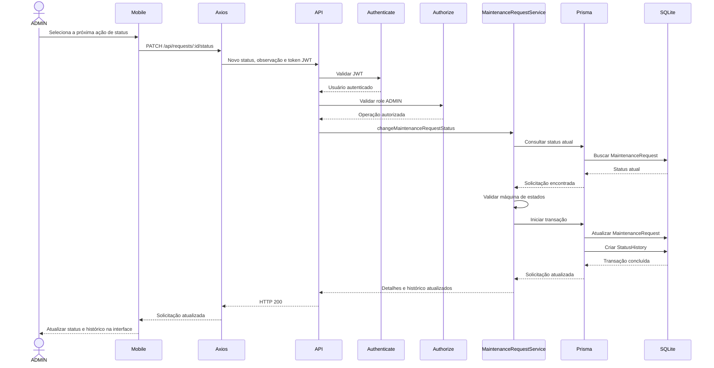

# Diagramas de Sequência

## Diagrama 1 — Criar solicitação com imagem

O fluxo separa a criação JSON do upload multipart. O arquivo só recebe um registro `RequestImage` depois das validações; uma falha posterior à gravação provoca a remoção do arquivo recém-criado.

## Diagrama 2 — ADMIN altera status

Autenticação e autorização acontecem antes da regra de domínio. O serviço aceita somente a próxima transição definida e usa uma transação Prisma para manter solicitação e histórico consistentes.

## Requisitos relacionados

- **Diagrama 1:** RF004, RF005, RF007, RF013, RF015, RNF003, RNF006, RNF007, RNF009 e RNF011.
- **Diagrama 2:** RF007, RF010, RF011, RF013, RF014, RNF003, RNF006, RNF007 e RNF009.
